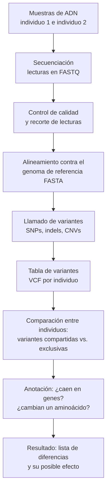
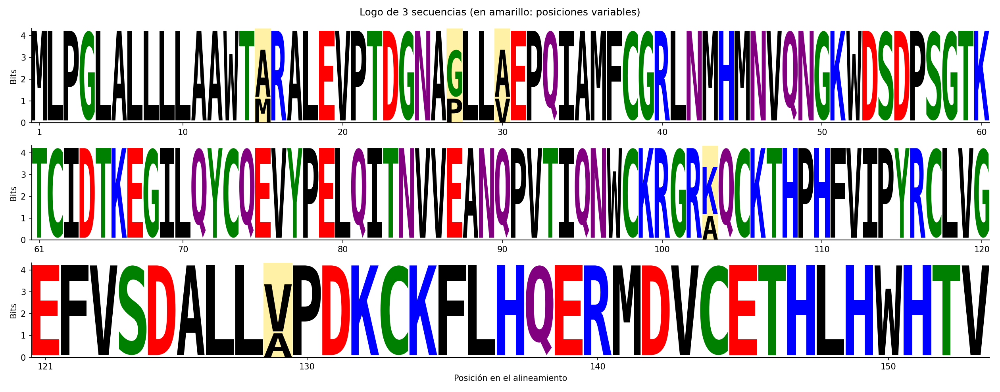

# TP: Biomoléculas

Resolución del TP [Biomoléculas: una breve introducción a nuestro mundo interior](https://github.com/AJVelezRueda/Introduccion_a_la_Bioinformatica/blob/master/Teorico_Practicos/Intro_a_la_Biolog%C3%ADa/Biomol%C3%A9culas.md) (Dra. Ana Julia Velez Rueda).

## Estructura

| Archivo | Qué resuelve |
|---|---|
| `estructura_secundaria.py` | Desafío V: predicción H/B/L (Chou-Fasman) |
| `motivos_uniprot.py` | Desafío VII: motivo de N-glicosilación en proteínas de UniProt |
| `logo.py` | Desafío VIII: sequence logo con logomaker |
| `datos/secuencias.fasta` | Las 3 secuencias del Desafío VIII |
| `datos/ids_ejemplo.txt` | IDs de ejemplo del problema de Rosalind |
| `datos/logo_*.png` | Logos ya generados |
| `tests/` | Tests con pytest |

Todos los comandos se corren **desde esta carpeta** (`cd biomoleculas`).

---

## 🧗 Desafío I: macromoléculas que guardan la "identidad" de un organismo

El ejemplo principal es el **ADN**: el genoma contiene la información hereditaria que define a la especie y, por sus variantes, a cada individuo (por eso se usa en pruebas de paternidad y en genética forense). Otros ejemplos:

- **ARN**: en muchos virus (gripe, SARS-CoV-2, VIH) el genoma es de ARN y es su "identidad".
- **Proteínas**: el conjunto de proteínas que expresa una célula (su proteoma) define qué *tipo* de célula es. Algunas funcionan literalmente como marcadores de identidad, como las proteínas **HLA/MHC**, que el sistema inmune usa para distinguir "lo propio" de "lo ajeno" (y que deben ser compatibles en un trasplante).
- **Glúcidos de superficie**: los antígenos de los **grupos sanguíneos ABO** son oligosacáridos unidos a proteínas y lípidos de los glóbulos rojos.

## 🧗 Desafío II: representar la estructura primaria de una proteína

La estructura primaria es la **secuencia ordenada** de aminoácidos, así que lo más natural es:

- **String (`str`)** con el código de una letra: `"MLPGLALLLL..."`. Es lo que usan el formato FASTA y casi todas las herramientas. Conserva el orden, ocupa poco y permite usar operaciones de texto (buscar motivos, slicing, expresiones regulares).
- **Lista de strings** con el código de tres letras: `["Met", "Leu", "Pro", ...]`.
- **Diccionario** para sumar metadatos: `{"id": "P07204", "organismo": "Homo sapiens", "secuencia": "MLG..."}`, o una **clase `Proteina`** con esos atributos y métodos (`largo()`, `peso_molecular()`).
- **Numérica**, para cálculo o machine learning: cada aminoácido como entero 0-19 (lista de `int`), o **one-hot encoding** (matriz L × 20 de 0 y 1).
- En **unos y ceros** literalmente: con 20 aminoácidos alcanzan **5 bits** por residuo (2⁵ = 32 > 20).

## 🧗 Desafío III: representar la estructura terciaria

La estructura terciaria es la **posición en el espacio de cada átomo**, así que necesitamos coordenadas 3D:

- **Lista de tuplas/diccionarios**: `[{"atomo": "CA", "residuo": "MET", "numero": 1, "cadena": "A", "x": 12.1, "y": 4.3, "z": -7.8}, ...]`. Es básicamente lo que guardan los formatos **PDB** y **mmCIF** de la base de datos PDB.
- **Estructura jerárquica** (diccionarios anidados u objetos): modelo → cadena → residuo → átomo. Así la representa, por ejemplo, Biopython (`Bio.PDB`).
- **Matriz/array (NumPy)** de N × 3 con las coordenadas, ideal para calcular distancias, superponer estructuras o calcular el RMSD.
- **Coordenadas internas**: una lista de ángulos diedros **φ/ψ** por residuo. Es más compacta y es la que usa el gráfico de Ramachandran.
- **Matriz de distancias o de contactos** (L × L) o un **grafo** donde los nodos son residuos y las aristas son contactos. Tiene la ventaja de no depender de cómo esté rotada la proteína.

## 🧗 Desafío IV: Rosalind Franklin

**Sus contribuciones:**
- Fue química y cristalógrafa experta en **difracción de rayos X**. En el King's College de Londres (1951-1953) mejoró la técnica para obtener imágenes de fibras de ADN y descubrió que existen dos formas, **A y B**, según la humedad.
- Con su estudiante Raymond Gosling obtuvo la **"Fotografía 51"** (1952), una imagen de la forma B cuyo patrón en forma de X indica una **hélice**.
- A partir de sus datos dedujo que los **fosfatos quedan hacia afuera** y las bases hacia adentro, y midió parámetros de la hélice.
- Su artículo sobre el ADN se publicó en el **mismo número de *Nature*** (abril de 1953) que el modelo de Watson y Crick, pero ubicado como si solo confirmara ese modelo.
- Después, en el Birkbeck College, hizo trabajos centrales sobre la estructura de **virus** (virus del mosaico del tabaco, poliovirus), además de trabajos previos sobre la estructura del **carbón y el grafito**.

**Qué pasó:** Maurice Wilkins, colega del King's College con quien tenía una relación difícil, le mostró la Fotografía 51 a James Watson **sin que ella lo supiera**, y Watson y Crick también accedieron a un informe interno con sus datos. Esa información fue clave para su modelo de doble hélice. Franklin murió de cáncer de ovario en **1958, con 37 años**. En **1962** Watson, Crick y Wilkins recibieron el **Nobel**, que no se otorga de forma póstuma. En su libro *La doble hélice* (1968), Watson la retrató de manera despectiva y sexista. Su colaborador Aaron Klug ganó el Nobel de Química en 1982, en parte por líneas de trabajo que empezaron juntos.

**Qué nos dice sobre la ciencia:**
- El **efecto Matilda**: el aporte de las mujeres científicas suele ser invisibilizado o atribuido a varones.
- La ciencia es una **construcción colectiva**, aunque los premios y el relato histórico se concentren en pocas figuras.
- Muestra la importancia de la **ética** en el manejo de datos ajenos: citar, pedir permiso y reconocer autorías.
- También muestra cómo los **entornos laborales hostiles** afectan quién puede hacer ciencia y quién es reconocido.
- Una lectura más reciente (Cobb y Comfort, *Nature*, 2023), basada en documentos de la época, propone verla como una **colaboradora en pie de igualdad** más que como "víctima de un robo". Esto no borra la injusticia en el reconocimiento, pero muestra que la historia se sigue revisando con nuevas fuentes.

> 👉 La consigna sugiere leer "El Caso de Rosalind Franklin" de *Mujeres con Ciencia*. **Leelo vos** y ajustá esta respuesta con lo que te parezca más relevante.

## 🧗 Desafío V: predicción de estructura secundaria (`estructura_secundaria.py`)

**Método:** Chou-Fasman simplificado. Cada aminoácido tiene una propensión a estar en hélice (Pα) o en hoja beta (Pβ), calculada a partir de estructuras conocidas (por ejemplo, Glu, Met y Ala favorecen hélices; Val, Ile y Tyr favorecen hojas; Pro y Gly las rompen). Para cada residuo se promedian las propensiones en una ventana de vecinos y se asigna **H**, **B** o **L**; luego se eliminan hélices de menos de 4 residuos y hojas de menos de 3.

☑️ **Preguntas disparadoras**
- **Inputs:** la secuencia proteica (por argumento, archivo FASTA o stdin), la tabla de propensiones y parámetros ajustables (umbrales, tamaño de ventana).
- **Output:** un string del mismo largo que la secuencia, con H/B/L, alineado debajo de la secuencia para leerlo fácilmente. También exporta a FASTA, **CSV** (una fila por residuo, con Pα y Pβ; ideal para graficar) y **JSON** (para usarlo desde otro programa).

```bash
python estructura_secundaria.py MLPGLALLLLAAWTMRALEVPTDGNAPLLVEPQIAMFCGR
python estructura_secundaria.py --fasta datos/secuencias.fasta
python estructura_secundaria.py --fasta datos/secuencias.fasta --formato csv > prediccion.csv
```

```
> sec1 (153 aa)
    1  MLPGLALLLLAAWTMRALEVPTDGNAPLLVEPQIAMFCGRLNMHMNVQNGKWDSDPSGTK
       HHHHHLLHHHHHHHHHHHHHHLLLLLLLLLHHHHLLLLLLLLLLLLLLLLLLLLLLLLLL
```

> ⚠️ Chou-Fasman es un método de los años 70 con ~50-60% de acierto. Sirve para entender la idea, pero hoy se usan métodos basados en redes neuronales (PSIPRED, o directamente la estructura 3D predicha por AlphaFold) que superan el 80%.

## 🤔 Para pensar: ¿cuántas proteínas puede sintetizar un organismo?

Depende en primer lugar de **cuántos genes codificantes** tiene su genoma (unos 20.000 en humanos, ~4.000 en *E. coli*). Pero el número de proteínas distintas es **mucho mayor** que el de genes, gracias a:
- **Splicing alternativo**: un mismo gen puede dar varias isoformas combinando distintos exones.
- **Modificaciones postraduccionales**: fosforilación, glicosilación (¡como la del Desafío VII!), cortes proteolíticos, etc.
- Distintos sitios de inicio de la transcripción o de la traducción.

A su vez, **qué** proteínas se sintetizan y **cuántas** depende de la **regulación de la expresión génica**: el tipo celular, la etapa del desarrollo y las señales del entorno. Una neurona y un hepatocito tienen el mismo genoma pero proteomas muy distintos.

## 🧗 Desafío VI: ¿qué hace distintos a dos individuos de una especie?

Principalmente, **diferencias en la secuencia de su ADN**: dos personas comparten ~99,9% del genoma, pero ese 0,1% son millones de posiciones. Los tipos de variantes son:
- **SNPs**: cambios de un solo nucleótido (los más frecuentes).
- **Indels**: pequeñas inserciones o deleciones.
- **Variantes estructurales y en número de copias (CNVs)**: segmentos grandes duplicados, perdidos o invertidos.

A esto se suman la **epigenética** (por ejemplo, la metilación del ADN, que cambia qué genes se expresan sin cambiar la secuencia) y el **ambiente**; por eso los gemelos idénticos tampoco son exactamente iguales.

☑️ **¿Qué información necesito y cómo la expreso?** Necesito las **secuencias genómicas** (o de las regiones de interés) de los individuos, idealmente en formato **FASTQ** (lecturas crudas de la secuenciación con su calidad), una **secuencia de referencia** de la especie en **FASTA**, y el resultado final como una tabla de variantes en formato **VCF** (posición, base de referencia, base alternativa, genotipo de cada individuo).

**Método computacional propuesto:**



Una versión mínima para programar en clase: si ya tenemos dos secuencias alineadas del mismo largo, recorrerlas posición por posición y listar dónde difieren (es lo que hace `logo.py --solo-variables` en el Desafío VIII).

## 🧗 Desafío VII: motivos de N-glicosilación (`motivos_uniprot.py`)

La notación del motivo se traduce a una expresión regular: `N{P}[ST]{P}` → `N[^P][ST][^P]`. Como las apariciones pueden **solaparse**, se busca con un *lookahead* `(?=(...))`. Las secuencias se descargan de la API REST de UniProt (la URL vieja del enunciado hoy redirige a `rest.uniprot.org`).

```bash
python motivos_uniprot.py --archivo datos/ids_ejemplo.txt
python motivos_uniprot.py B5ZC00 P07204_TRBM_HUMAN
python motivos_uniprot.py --fasta-local mis_proteinas.fasta   # sin internet
python motivos_uniprot.py B5ZC00 --motivo "[ST]x[RK]"          # otro motivo
```

Salida esperada para el ejemplo de Rosalind (A2Z669 no tiene el motivo, por eso no aparece):
```
B5ZC00
85 118 142 306 395
P07204_TRBM_HUMAN
47 115 116 382 409
P20840_SAG1_YEAST
79 109 135 248 306 348 364 402 485 501 614
```

> Si UniProt actualizó alguna de esas secuencias, las posiciones podrían cambiar levemente respecto a las de Rosalind.

## 🧗 Desafío VIII: sequence logo (`logo.py`)

```bash
python logo.py datos/secuencias.fasta                               # frecuencias
python logo.py datos/secuencias.fasta --tipo informacion -o logo_bits.png
python logo.py datos/secuencias.fasta --solo-variables              # solo las diferencias
```

Las tres secuencias son casi idénticas; solo difieren en **5 posiciones** (resaltadas en amarillo en el logo), y en todas ellas la secuencia 1 es la distinta:

| Posición | sec1 | sec2 | sec3 |
|---|---|---|---|
| 15 | M | A | A |
| 27 | P | G | G |
| 30 | V | A | A |
| 103 | A | K | K |
| 129 | A | V | V |

En el logo en **bits**, las posiciones conservadas alcanzan la altura máxima (log₂20 ≈ 4,32 bits) y las variables quedan más bajas, que es justamente lo que un logo permite ver de un vistazo.

> Detalle técnico: `logomaker.alignment_to_matrix` suma por defecto un *pseudocount* de 1, que con solo 3 secuencias hace aparecer los 20 aminoácidos en todas las columnas. Por eso se usa `pseudocount=0`.



## Tests

```bash
python -m pytest tests -v
```
